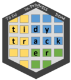

[](https://www.tidyverse.org/lifecycle/#experimental)
[](https://travis-ci.org/emilyriederer/ghtrackr)

# ghtrackr 

The goal of `ghtrackr` is to help reduce time spent on tedious project management tasks to free up time for more exciting things like R coding and data analysis. `ghtrackr` does this by providing a convenient interface between your R-based workflow and GitHub, with a particular focus on GitHub's project management capabilities.

## Try before you buy!

Want to find out more about `ghtrackr` before you commit? Check out the [package website](https://github.com/pages/emilyriederer/ghtrackr/).

## Installation

You can install the current, experimental version of `ghtrackr` with:

``` r
devtools::install_github("emilyriederer/ghtrackr")
```

but please note that nearly everything is subject to change at this point.


 Please note that this project is released with a [Contributor Code of Conduct](CODE_OF_CONDUCT.md).
  By participating in this project you agree to abide by its terms.
