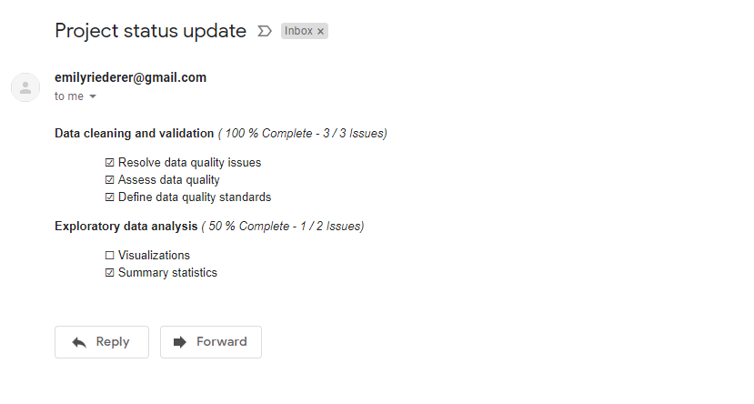

```{r setup, include = FALSE}
knitr::opts_chunk$set(
  collapse = TRUE,
  comment = "#>"
)

library(projmgr)
```

Just like the `report` family of functions makes it easy to share project updates in an HTML RMarkdown, these reporters can also help create and send well-formatted email reminders to colleagues. 

Note that this will work with all `report` functions *except* `report_taskboard()` because most eail clients do not yet support CSS grid.

## Report Overview

The `report` functions are discussed in more detial in the "Reporting" vignette. As a brief overview, they generally take the output of a `parse` function and rewrite the output with HTML.

```{r echo = FALSE}
issues <- 
  readRDS(system.file("extdata", "anproj-issues.rds", package = "projmgr", mustWork = TRUE))
```

```{r eval = FALSE}
my_repo <- create_repo_ref("emilyriederer", "my_repo")
issues_res <- get_issues( my_repo , state = "all" )
issues <- parse_issues(issues_res)
```

```{r}
report_progress(issues)
```

By default, the `link_url` argument is set to `TRUE`, so each item is linked to its corresponding GitHub issue.

In RMarkdown, the rendered HTML is shown because the `report` functions append the class `"knit_asis"` to the output, which tells `knitr` to directly insert the output into the final document instead of interpreting it as character output. However, to prove that this function is simply writing HTML, we can see the underlying HTML in RMarkdown by wiping that class:

```{r}
html <- report_progress(issues)
class(html) <- "character"
html
```

(Note - this is just for illustration purposes! You do **NOT** have to change the class in order to send emails.)

## Sending Emails

HTML output is convenient since most modern email clients support HTML-based email. We will show an example with `gmailr`, but a similar concept should work with `mailR` (with the `html = TRUE` option) and other email packages.

First, as before, simply assign the results of the `report` function to a variable.

```{r}
html <- report_progress(issues)
```

Next, we can construct an email message using `gmailr`, and pass our `html` object into the `gmailr::html_body()` function.

```{r eval = FALSE}
library(gmailr)

html_msg <-
mime() %>%
  to("you@somewhere.com") %>%
  from("me@somewhere.com") %>%
  subject("Project status update") %>%
  html_body( html )

send_message(html_msg)
```

The resulting email looks like this:


